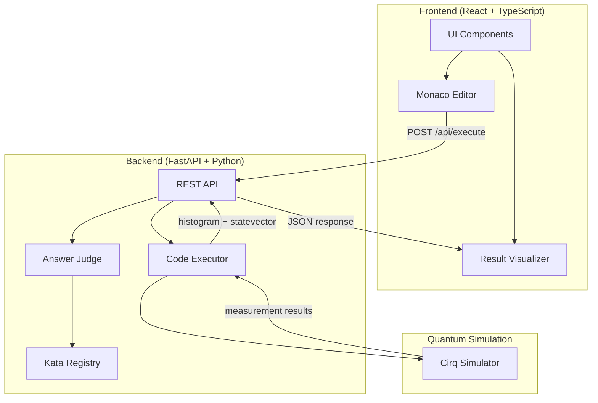

# quantum-katas

量子コンピューティングの基礎概念をインタラクティブなコーディング演習（カタ形式）で学べるWebアプリケーション。

**穴埋め → 実行 → 結果確認** のサイクルが数秒で完結し、量子力学の数学的背景なしでも直感的に量子ゲートを習得できます。

## アーキテクチャ



## 機能概要

| 機能 | 説明 |
|------|------|
| 10段階カリキュラム | 量子ビット基礎からグローバー探索まで段階的に学習 |
| ブラウザ内エディタ | Monaco Editorベースの穴埋めコーディング |
| リアルタイム実行 | Cirqによる量子回路シミュレーションをバックエンドで実行 |
| 結果可視化 | 測定ヒストグラム・状態ベクトルをグラフィカル表示 |
| ヒントシステム | 3段階ヒントで段階的にサポート |
| 進捗トラッカー | ローカルストレージで学習進捗を管理 |

## カタ一覧

| # | カタ名 | 学習概念 |
|---|--------|---------|
| 1 | Hello Qubit | 量子ビットの基本 |
| 2 | NOT Gate | パウリXゲート |
| 3 | Superposition | アダマールゲート |
| 4 | Measurement | 測定と確率 |
| 5 | Phase Kick | Zゲート・位相 |
| 6 | Entanglement | CNOTゲート・量子もつれ |
| 7 | Bell States | ベル状態 |
| 8 | Quantum Teleportation | 量子テレポーテーション |
| 9 | Deutsch's Algorithm | ドイチュアルゴリズム |
| 10 | Grover's Search | グローバー探索 |

## 技術スタック

- **Backend**: Python 3.12+ / FastAPI / Cirq
- **Frontend**: TypeScript / React 19 / Monaco Editor / Tailwind CSS
- **Testing**: pytest / Vitest

## ディレクトリ構成

```
quantum-katas/
├── backend/
│   ├── src/quantum_katas/    # FastAPI アプリケーション
│   ├── tests/                # pytest テスト
│   └── pyproject.toml        # Python プロジェクト設定
├── frontend/
│   ├── src/
│   │   ├── components/       # React コンポーネント
│   │   ├── hooks/            # カスタムフック
│   │   ├── lib/              # ユーティリティ
│   │   └── types/            # TypeScript 型定義
│   ├── public/
│   ├── package.json
│   └── tsconfig.json
├── docs/
│   ├── use-cases.md          # ユースケースフロー
│   └── screens.md            # 画面設計
├── PRD.md
├── CLAUDE.md
└── .claude/
    ├── CLAUDE.md             # アーキテクチャ詳細
    ├── settings.json         # Claude Code hooks
    ├── startup.sh            # セッション起動スクリプト
    └── scripts/
        └── post-lint.sh      # PostToolUse lint hook
```

## セットアップ

### Backend

```bash
cd backend
python -m venv .venv
source .venv/bin/activate
pip install -e ".[dev]"
uvicorn quantum_katas.main:app --reload
```

### Frontend

```bash
cd frontend
npm install
npm run dev
```

## ライセンス

MIT
