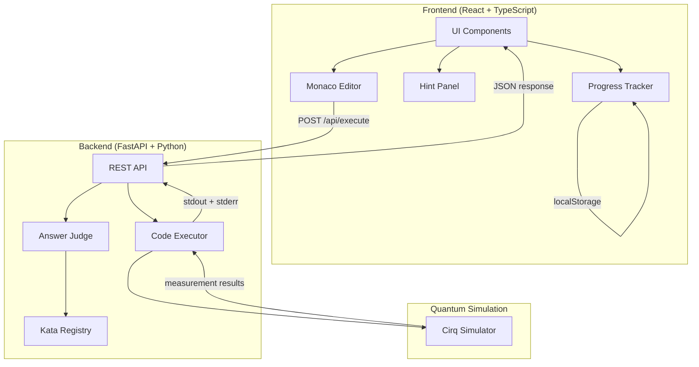

# quantum-katas

量子コンピューティングの基礎概念をインタラクティブなコーディング演習（カタ形式）で学べるWebアプリケーション。

**穴埋め → 実行 → 結果確認** のサイクルが数秒で完結し、量子力学の数学的背景なしでも直感的に量子ゲートを習得できます。

```
+================================================================+
|  Quantum Katas                           [進捗: 3/10 ████░░]   |
+================================================================+
|                                                                 |
|  Basics                                                         |
|  +-------------------------+  +-------------------------+       |
|  | 量子ビットの基礎    [v] |  | Pauli-X ゲート      [v] |       |
|  | 1/10  Basics             |  | 2/10  Basics             |       |
|  +-------------------------+  +-------------------------+       |
|  +-------------------------+  +-------------------------+       |
|  | アダマールゲート     [v] |  | 測定と確率          [ ] |       |
|  | 3/10  Basics             |  | 4/10  Basics             |       |
|  +-------------------------+  +-------------------------+       |
|                                                                 |
|  +--------------------------+  +--------------------------+     |
|  | Code Editor              |  | 実行結果                  |     |
|  | import cirq              |  | result=0000000000         |     |
|  | q = cirq.LineQubit(0)    |  | 実行成功                  |     |
|  | # YOUR CODE HERE         |  |                           |     |
|  |                          |  |                           |     |
|  | [実行] [提出] [リセット] |  |                           |     |
|  +--------------------------+  +--------------------------+     |
|                                                                 |
|  Hints (1/3)                                                    |
|  +----------------------------------------------------------+  |
|  | 💡 Hint 1                                                  |  |
|  |   cirq.LineQubit(0) で量子ビットを作成できます             |  |
|  +----------------------------------------------------------+  |
|  [ 💡 Hint 2 を表示 (2 残り) ]                                  |
+================================================================+
```

## クイックスタート

### 前提条件

- Python 3.12+
- Node.js 20+
- pnpm

### Backend

```bash
cd backend
python -m venv .venv
source .venv/bin/activate
pip install -e ".[dev]"
uvicorn quantum_katas.main:app --reload
```

### Frontend

```bash
cd frontend
pnpm install
pnpm dev
```

ブラウザで http://localhost:5173 を開くと、カタ一覧が表示されます。

> バックエンドが起動していない場合、モックデータで動作します（コード実行・検証は不可）。

### テスト

```bash
# 全チェック
make check

# Backend のみ
cd backend && pytest

# Frontend のみ
cd frontend && pnpm test
```

## アーキテクチャ



## 機能概要

| 機能 | 説明 |
|------|------|
| 10段階カリキュラム | 量子ビット基礎からDeutsch-Jozsaアルゴリズムまで段階的に学習 |
| ブラウザ内エディタ | Monaco Editorベースの穴埋めコーディング (Ctrl+Enter で実行) |
| リアルタイム実行 | Cirqによる量子回路シミュレーションをバックエンドで実行 |
| 結果可視化 | 回路図・測定結果をリアルタイム表示 |
| 3段階ヒントシステム | 折りたたみUI + localStorage永続化で段階的にサポート |
| 進捗トラッカー | 完了/未完了/ロック状態の可視化 + 全クリア祝福メッセージ |
| 正解判定 | バックエンドで検証コードを実行し、自動採点 |

## カタ一覧

| # | カタ名 | 学習概念 | カテゴリ |
|---|--------|---------|---------|
| 1 | Hello Qubit | 量子ビットの基本 | Basics |
| 2 | NOT Gate | パウリXゲート | Basics |
| 3 | Superposition | アダマールゲート | Basics |
| 4 | Measurement | 測定と確率 | Basics |
| 5 | Phase Kick | Zゲート・位相 | Basics |
| 6 | Multi-Qubit | 複数量子ビット | Entanglement |
| 7 | CNOT Gate | CNOTゲート | Entanglement |
| 8 | Bell States | ベル状態 | Entanglement |
| 9 | Quantum Teleportation | 量子テレポーテーション | Algorithms |
| 10 | Deutsch-Jozsa | Deutsch-Jozsaアルゴリズム | Algorithms |

## 構築済みの開発基盤

| 基盤 | 詳細 |
|------|------|
| CI/CD | GitHub Actions (backend lint/test + frontend lint/typecheck/test) |
| Backend lint/format | Ruff (120行制限, 70+ルール有効) |
| Frontend lint/format | Biome (`any` 禁止, `noExplicitAny: error`) |
| Backend テスト | pytest + pytest-cov (カバレッジ 80% 以上必須, 現在 96%) |
| Frontend テスト | Vitest + Testing Library (54 テスト) |
| 型安全性 | TypeScript strict mode + `noUncheckedIndexedAccess` |
| セキュリティ | コード実行サンドボックス (AST検証 + builtins制限 + タイムアウト) |
| ADR | `docs/adr/001-code-execution-sandbox.md` |

### テストカバレッジ

- **Backend**: 76 テスト, カバレッジ 96% (80% 必須)
- **Frontend**: 54 テスト (8 テストファイル)
- **合計**: 130 テスト

## 技術スタック

- **Backend**: Python 3.12+ / FastAPI / Cirq
- **Frontend**: TypeScript / React 19 / Monaco Editor
- **Testing**: pytest + Vitest
- **Lint**: Ruff + Biome
- **CI**: GitHub Actions

## ディレクトリ構成

```
quantum-katas/
├── backend/
│   ├── src/quantum_katas/
│   │   ├── routers/           # API エンドポイント
│   │   ├── services/          # ビジネスロジック (executor, judge, registry)
│   │   ├── models/            # データモデル
│   │   └── data/katas/        # カタ定義 (YAML x 10)
│   ├── tests/                 # pytest テスト (76件)
│   └── pyproject.toml
├── frontend/
│   ├── src/
│   │   ├── components/        # React コンポーネント (6個)
│   │   ├── hooks/             # カスタムフック (3個)
│   │   ├── lib/               # APIクライアント + 定数 + モックデータ
│   │   └── types/             # TypeScript 型定義
│   ├── package.json
│   └── vite.config.ts
├── docs/
│   ├── adr/                   # Architecture Decision Records
│   ├── screens.md             # 画面設計
│   └── use-cases.md           # ユースケースフロー
├── .github/workflows/ci.yml   # CI設定
├── Makefile                   # make check (全チェック一括実行)
├── PRD.md                     # プロダクト要求仕様
├── CLAUDE.md                  # 開発ガイドライン
└── README.md
```

## ライセンス

MIT
