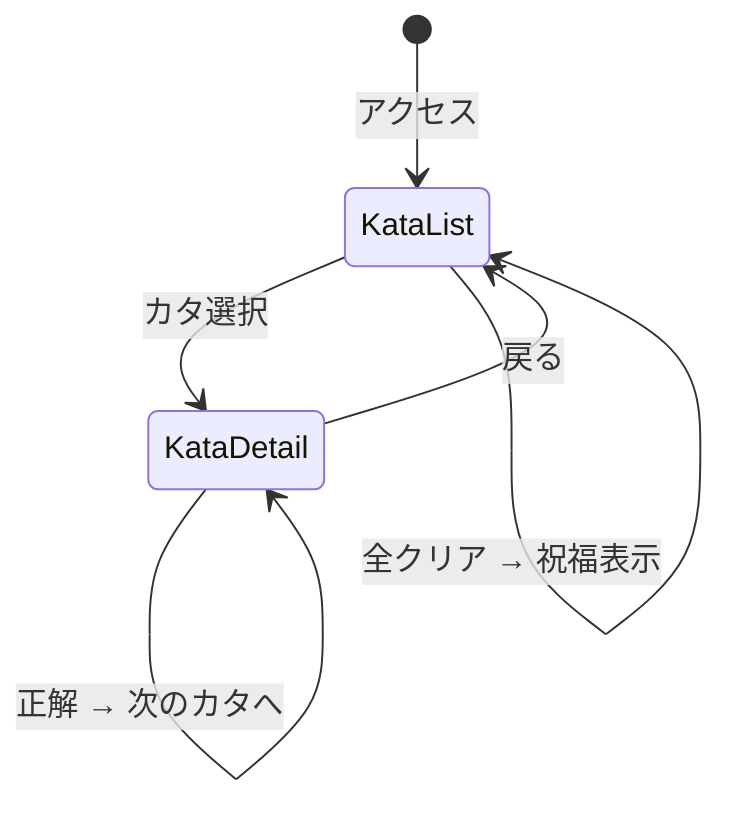

# 画面設計

## 画面遷移図



## 実装済みコンポーネント構成

```
src/
├── App.tsx                          # ルーティング + QueryClient + ヘッダー (ProgressBar)
├── main.tsx                         # エントリポイント
├── index.css                        # グローバルCSS (ダークテーマ)
├── components/
│   ├── KataList.tsx                  # カタ一覧 (カテゴリ別グリッド + 完了アイコン + 祝福バナー)
│   ├── KataDetail.tsx               # カタ詳細 (解説 + エディタ + 結果 + ヒント + ナビ)
│   ├── CodeEditor.tsx               # Monaco Editor ラッパー (Ctrl+Enter 実行)
│   ├── ExecutionResult.tsx          # 実行結果 + 検証結果 + 回路図表示
│   ├── HintPanel.tsx                # 3段階ヒント (折りたたみ + localStorage永続化)
│   └── ProgressBar.tsx              # 進捗バー (n/10 完了)
├── hooks/
│   ├── useKatas.ts                  # カタデータ取得 (React Query)
│   ├── useExecution.ts              # コード実行
│   └── useProgress.ts              # 進捗管理 (useSyncExternalStore + localStorage)
├── lib/
│   ├── api.ts                       # APIクライアント (自動mock fallback)
│   ├── constants.ts                 # 定数 (TOTAL_KATAS, CATEGORY_ORDER 等)
│   └── mock-data.ts                 # モックデータ (10カタ分)
└── types/
    ├── kata.ts                      # カタ関連型
    └── execution.ts                 # 実行関連型
```

## S1: カタ一覧画面 (/)

```
+================================================================+
|  Quantum Katas                             [進捗: 3/10 ██░░]   |
+================================================================+
|                                                                 |
|  [バックエンド未接続 — モックデータで表示しています]              |
|                                                                 |
|  3/10 完了 ████████░░░░░░░░░░░░░░░░░░                          |
|                                                                 |
|  Basics                                                         |
|  +---------------------------+  +---------------------------+   |
|  |  量子ビットの基礎     [v] |  |  Pauli-X ゲート       [v] |   |
|  |  1/10   Basics             |  |  2/10   Basics             |   |
|  +---------------------------+  +---------------------------+   |
|  +---------------------------+  +---------------------------+   |
|  |  アダマールゲート      [v] |  |  測定と確率           [ ] |   |
|  |  3/10   Basics             |  |  4/10   Basics             |   |
|  +---------------------------+  +---------------------------+   |
|  +---------------------------+                                  |
|  |  Pauli-Z ゲート       [ ] |                                  |
|  |  5/10   Basics             |                                  |
|  +---------------------------+                                  |
|                                                                 |
|  Entanglement                                                   |
|  +---------------------------+  +---------------------------+   |
|  |  複数量子ビット       [x] |  |  CNOT ゲート          [x] |   |
|  |  6/10   Entanglement       |  |  7/10   Entanglement       |   |
|  +---------------------------+  +---------------------------+   |
|  +---------------------------+                                  |
|  |  ベル状態             [x] |                                  |
|  |  8/10   Entanglement       |                                  |
|  +---------------------------+                                  |
|                                                                 |
|  Algorithms                                                     |
|  +---------------------------+  +---------------------------+   |
|  |  量子テレポーテーション[x] |  |  Deutsch-Jozsa        [x] |   |
|  |  9/10   Algorithms         |  |  10/10  Algorithms         |   |
|  +---------------------------+  +---------------------------+   |
|                                                                 |
+================================================================+

アイコン凡例:
  [v] = 完了 (緑チェック)
  [ ] = 未完了 (白丸)
  [x] = ロック (南京錠、前提未完了)
```

## S2: カタ詳細画面 (/kata/:id)

```
+================================================================+
|  Quantum Katas                             [進捗: 3/10 ██░░]   |
+================================================================+
|  <- カタ一覧                                                    |
|  [v] 量子ビットの基礎                                           |
|  1/10  Basics                                                   |
|                                                                 |
|  +----------------------------------------------------------+  |
|  | Cirqを使って1量子ビットを作成し、測定する基本的な         |  |
|  | 量子回路を構築します。                                     |  |
|  +----------------------------------------------------------+  |
|                                                                 |
|  +----------------------------------------------------------+  |
|  | ## 量子ビット (Qubit)                                      |  |
|  | 量子ビットは量子コンピューティングの基本単位です...         |  |
|  +----------------------------------------------------------+  |
|                                                                 |
|  +---------------------------+  +---------------------------+   |
|  | Code Editor               |  | 実行結果                   |   |
|  | +-----------------------+ |  | +-----------------------+ |   |
|  | | Python (Cirq)   Ctrl+ | |  | | result=0000000000     | |   |
|  | | Enter で実行           | |  | |                       | |   |
|  | |                       | |  | | 実行成功               | |   |
|  | | import cirq           | |  | +-----------------------+ |   |
|  | | # YOUR CODE HERE      | |  |                           |   |
|  | | ...                   | |  |                           |   |
|  | +-----------------------+ |  |                           |   |
|  |                           |  |                           |   |
|  | [実行] [提出] [リセット]  |  |                           |   |
|  +---------------------------+  +---------------------------+   |
|                                                                 |
|  Hints (1/3)                                                    |
|  +----------------------------------------------------------+  |
|  | [v] 💡 Hint 1                                              |  |
|  |   cirq.LineQubit(0) で量子ビットを作成できます             |  |
|  +----------------------------------------------------------+  |
|  [ 💡 Hint 2 を表示 (2 残り) ]                                  |
|                                                                 |
|  <- Pauli-X ゲート            アダマールゲート ->               |
+================================================================+
```

## S3: 全クリア時の祝福バナー

```
+====================================+
|                                    |
|        All Clear!                  |
|                                    |
|  全10カタを制覇しました。          |
|  量子コンピューティングの          |
|  基礎をマスターです!              |
|                                    |
+====================================+
```

## レスポンシブ対応

| 画面幅 | レイアウト |
|--------|-----------|
| >= 1024px | 2カラム (エディタ | 結果) |
| 768-1023px | 2カラム (狭め) |
| < 768px | 1カラム (縦積み) |

## カラーパレット

| 用途 | カラー |
|------|--------|
| 背景 | #0f172a (slate-900) |
| カード | #1e293b (slate-800) |
| プライマリ | #6366f1 (indigo-500) |
| 正解 | #22c55e (green-500) |
| 不正解 | #ef4444 (red-500) |
| ヒント | #eab308 (yellow-500) |
| テキスト | #f8fafc (slate-50) |
