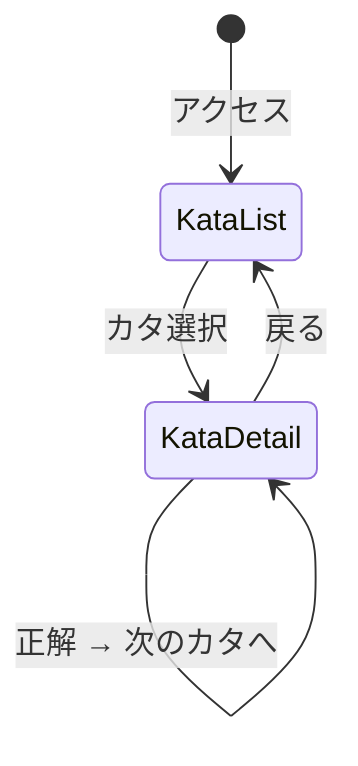

# 画面設計

## 画面遷移図



## S1: カタ一覧画面 (/)

```
+================================================================+
|  quantum-katas                              [進捗: 3/10 ██░░]  |
+================================================================+
|                                                                |
|  量子コンピューティングの基礎を、手を動かしながら学ぼう          |
|                                                                |
|  +---------------------------+  +---------------------------+  |
|  |  1. Hello Qubit       [v] |  |  2. NOT Gate          [v] |  |
|  |  量子ビットの基本          |  |  パウリXゲート             |  |
|  |  難易度: *                 |  |  難易度: *                 |  |
|  +---------------------------+  +---------------------------+  |
|                                                                |
|  +---------------------------+  +---------------------------+  |
|  |  3. Superposition     [v] |  |  4. Measurement       [ ] |  |
|  |  アダマールゲート          |  |  測定と確率               |  |
|  |  難易度: *                 |  |  難易度: **                |  |
|  +---------------------------+  +---------------------------+  |
|                                                                |
|  +---------------------------+  +---------------------------+  |
|  |  5. Phase Kick        [ ] |  |  6. Entanglement      [ ] |  |
|  |  Zゲート・位相             |  |  CNOTゲート・量子もつれ    |  |
|  |  難易度: **                |  |  難易度: **                |  |
|  +---------------------------+  +---------------------------+  |
|                                                                |
|  +---------------------------+  +---------------------------+  |
|  |  7. Bell States       [ ] |  |  8. Teleportation     [ ] |  |
|  |  ベル状態                  |  |  量子テレポーテーション    |  |
|  |  難易度: ***               |  |  難易度: ***               |  |
|  +---------------------------+  +---------------------------+  |
|                                                                |
|  +---------------------------+  +---------------------------+  |
|  |  9. Deutsch's Algo    [ ] |  |  10. Grover's Search  [ ] |  |
|  |  ドイチュアルゴリズム      |  |  グローバー探索           |  |
|  |  難易度: ***               |  |  難易度: ****              |  |
|  +---------------------------+  +---------------------------+  |
|                                                                |
+================================================================+

[v] = 完了済み, [ ] = 未完了
```

## S2: カタ詳細画面 (/katas/:id)

```
+================================================================+
|  [<戻る]  3. Superposition                  [進捗: 3/10 ██░░]  |
+================================================================+
|                         |                                      |
|  === 解説 ===           |  === コードエディタ ===               |
|                         |                                      |
|  アダマールゲート (H)    |  +--------------------------------+  |
|  は量子ビットを重ね合   |  | import cirq                    |  |
|  わせ状態にします。      |  |                                |  |
|                         |  | qubit = cirq.LineQubit(0)      |  |
|  |0> に H を適用すると:  |  | circuit = cirq.Circuit()       |  |
|                         |  |                                |  |
|  H|0> = (|0>+|1>)/sqrt2 |  | # TODO: アダマールゲートを      |  |
|                         |  | # 量子ビットに適用してください  |  |
|  Bloch球:               |  | circuit.append(________)       |  |
|      |0>                |  |                                |  |
|       |                 |  | circuit.append(                |  |
|   ----+---- H|0>        |  |     cirq.measure(qubit,        |  |
|       |                 |  |                  key='result') |  |
|      |1>                |  | )                              |  |
|                         |  +--------------------------------+  |
|                         |                                      |
|  +--------------------+ |  [  実行  ]  [  提出  ]              |
|  | ヒント (0/3)    [?]| |                                      |
|  +--------------------+ |  === 実行結果 ===                     |
|                         |                                      |
|                         |  result  |  count                    |
|                         |  --------|--------                   |
|                         |  0       |  ████████████  512        |
|                         |  1       |  ████████████  488        |
|                         |                                      |
|                         |  [正解! 次のカタへ ->]                |
|                         |                                      |
+================================================================+
```

## S3: ヒントパネル展開時

```
+====================================+
|  ヒント (2/3)                      |
+====================================+
|                                    |
|  ヒント 1:                         |
|  アダマールゲートを使ってみま      |
|  しょう。Cirqではcirqモジュール    |
|  から利用できます。                |
|                                    |
|  ヒント 2:                         |
|  cirq.H を量子ビット(qubit)に     |
|  適用します。                      |
|                                    |
|  [もう1つヒントを見る]             |
|                                    |
+====================================+
```

## S4: 正解時のフィードバック

```
+====================================+
|                                    |
|         Correct!                   |
|                                    |
|  アダマールゲートで重ね合わせ      |
|  状態を作ることができました。      |
|                                    |
|  測定結果が |0> と |1> にほぼ      |
|  均等に分布していることを確認      |
|  してください。                    |
|                                    |
|  [次のカタへ: 4. Measurement ->]   |
|                                    |
+====================================+
```

## レスポンシブ対応

| 画面幅 | レイアウト |
|--------|-----------|
| >= 1024px | 2カラム (解説 | エディタ+結果) |
| 768-1023px | 2カラム (狭め) |
| < 768px | 1カラム (解説 → エディタ → 結果 縦積み) |

## カラーパレット

| 用途 | カラー |
|------|--------|
| 背景 | #0f172a (slate-900) |
| カード | #1e293b (slate-800) |
| プライマリ | #6366f1 (indigo-500) |
| 正解 | #22c55e (green-500) |
| 不正解 | #ef4444 (red-500) |
| ヒント | #f59e0b (amber-500) |
| テキスト | #f8fafc (slate-50) |
