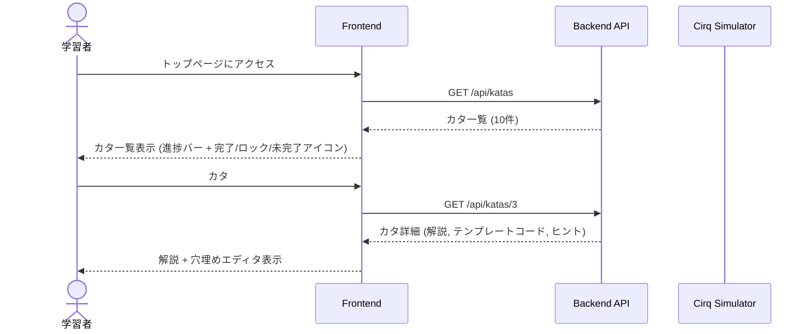
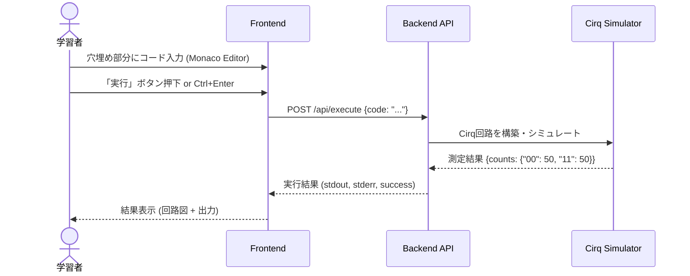
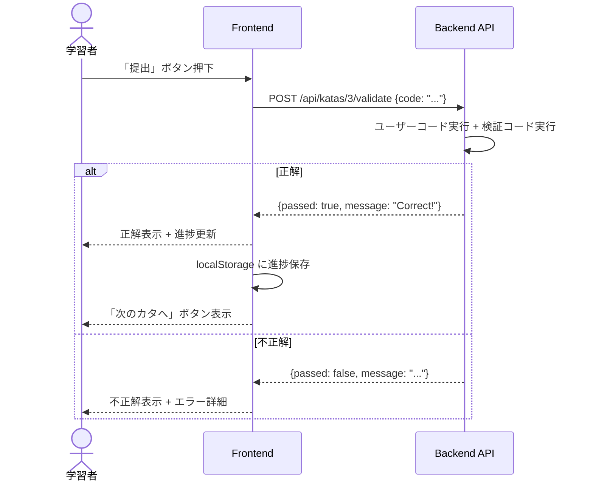
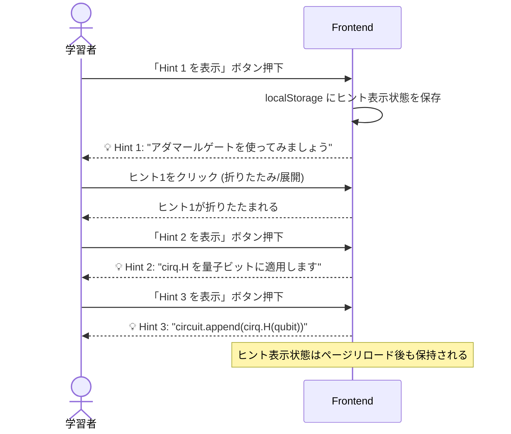
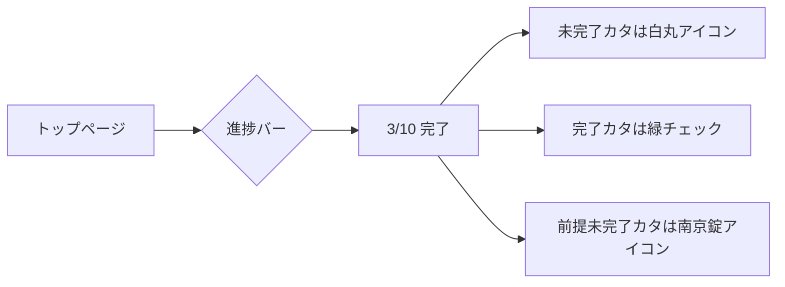
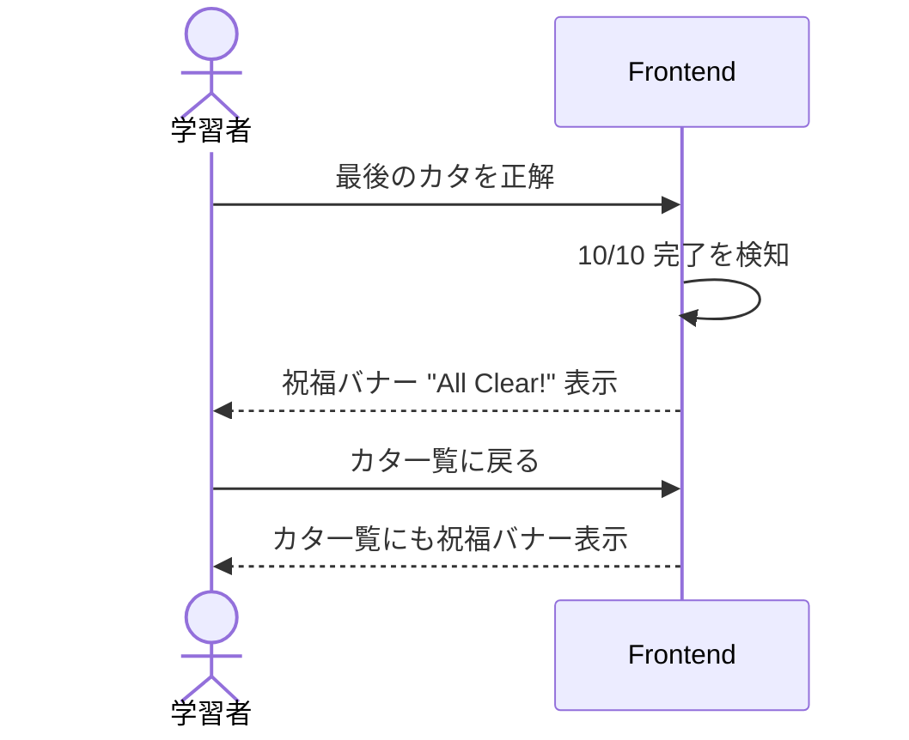

# ユースケースフロー

## UC-1: カタを選んで学習する [実装済み]

## UC-2: コードを編集して実行する [実装済み]

## UC-3: 正解判定を受ける [実装済み]

## UC-4: ヒントを使う [実装済み]

## UC-5: 進捗を確認する [実装済み]

## UC-6: 全クリアを達成する [実装済み]

## ユースケース一覧

| ID | ユースケース名 | アクター | 優先度 | ステータス |
|----|--------------|---------|--------|-----------|
| UC-1 | カタを選んで学習する | 学習者 | P0 | 実装済み |
| UC-2 | コードを編集して実行する | 学習者 | P0 | 実装済み |
| UC-3 | 正解判定を受ける | 学習者 | P0 | 実装済み |
| UC-4 | ヒントを使う | 学習者 | P1 | 実装済み |
| UC-5 | 進捗を確認する | 学習者 | P1 | 実装済み |
| UC-6 | 全クリアを達成する | 学習者 | P2 | 実装済み |
